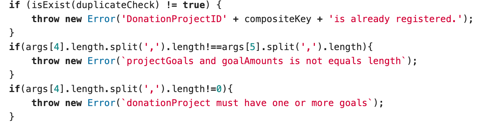

## 기브기부(Give기부)

### 주제 : 블록체인 기반 목표달성 기부 서비스 💡

역할 : 팀장(jira, git관리), 하이퍼렛저 체인코드 구현(javascript), 프론트엔드(React, Redux, Redux-saga)

많은 사람들이 기부를 하고 있지만 그 기부금들이 어떻게 쓰여지는지 알 수 없습니다. 또한 대두분의 기관들은 잘사용하지만 일부 부정한 기관들이 있을 수 있습니다. 또한 기부를 진행하면서 자신의 돈이 어떻게 쓰여지는 지를 몰라 기부에 대한 동기부여 및 지속성에 대한 회의감을 갖게 됩니다. 이에 따라 우리는 사이트 해피빈의 형태로 기부에 대한 후원을 받을 수 있게합니다.  이것은 블록체인에 컨트랙트로 구성되며 기부금이 쓰이는 기록을 투명하게 공개하고, 모금의 대한 목적의 성과 달성 여부에 따라 단계적으로 기부 절차를 진행시켜 절차적으로 기관에서 기부 금액을 사용할 수 있도록합니다.

UI는 기본뼈대는 antd의 디잔인을 사용을 했습니다. 

## 구현시 가장 힘들었던 부분

### 1. React안의  UI를 위한 엄청난 조건문

초기에 기부 프로젝트에는 여러가지의 상태들이 존재하고 프로젝트에 기부자 인지, 프로젝트 등록자인지 등의 여러가지의 상황이 있었습니다. 이에 따라 아래의 엄청난 조건문이 생겨 났습니다. 초반 작업 부터 이렇게 함수로 꺼내서 if을 직적사용하여 구현했으면 보다 편했겠지만 초반에는 render() 함수안에서 3항 연산자를 통해 구현하여 더욱 힘들었습니다.

초기 코드

### 2. Javascript로 구현되는 ChainCode의 검증 코드들

블록체인에 등록되는 데이터는 오라클 문제 즉, 외부로 부터 드러오는 데이터에 의해 내부의 데이터가 더렵혀지면 안되기떄문에 많은 검증 코드들을 통해 내부의 데이터를 통해 여러가지 검증을 해야합니다. 유저가 있는가?, 목표가 완료되었는가?, 환불되었는가?, 기부를 했는가? 등등 많은 검증코드들이 들어가게 됩니다. 이러한 부분들을 세세하게 생각하고 구현하는 부분이 코드는 쉬울지 모르지만 많은 실행과 생각의 시간이 필요로 했습니다.

### 3. Build 시 알수없는 애러를 통한 render() 함수 이상

개발환경에서는 // 주석이 render함수의 return안에 들어가도 정상 동작을 하지만 배포할 경우 에러를 발생합니다.

따라서 JSX에서 return안에는 {/**/}형태의 주석을 사용해야합니다. 이후 빠르게 Hot Fix를 진행했습니다.

## 팀장 : Git관리 Jira 관리

### gitFlow를 통한 브랜치 그래프

### jira 관리

## 구현 화면

### 1. 메인 페이지

### 2. 로그인 페이지

### 3. 유저 정보

### 4. 기부 등록 페이지

### 5. 메뉴 페이지

### 6. 기부 상세 페이지

### 7. 블록체인 활용 이유

#### 추가적으로 결제 완료, 목표 등록, 목표 확인 페이지가 있습니다.